# Arrow — Architecture, Design & Flow

This document describes the Arrow platform end-to-end: what the pieces are,
how they fit together, how data flows at runtime, and how the codebase is
laid out. All diagrams are Mermaid; render in GitHub or any Mermaid-aware
viewer.

> See `README.md` for the product spec, `CLAUDE.md` for codebase conventions,
> and `SECURITY.md` / `NIST_CSF2.md` for security posture.

---

## 1. System context

Arrow is a TAK-style situational-awareness platform with three deployable
artifacts that talk to a single source of truth (the backend).

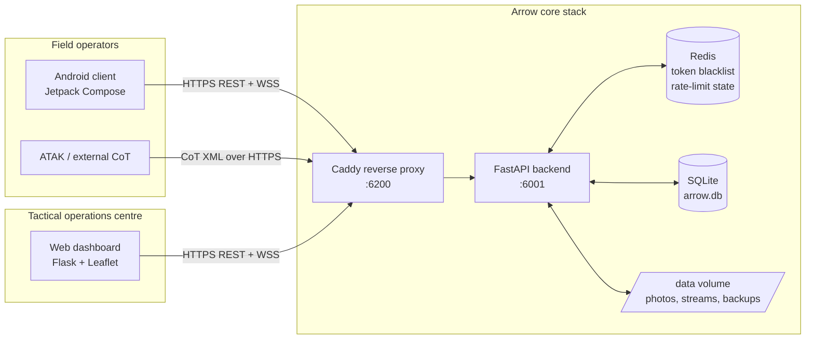

**Trust boundary:** everything outside `Core` is untrusted; the only
authenticated entrypoint is the backend, fronted by Caddy.

---

## 2. Component map

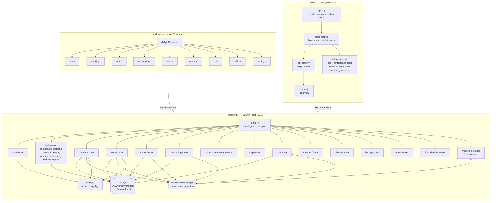

The web dashboard is intentionally **thin**: Python only renders HTML
shells; all live data is fetched by the browser via the `/api/*` proxy
and the WebSocket.

---

## 3. Backend module layering (Clean Architecture)

Each domain module is being progressively split into four layers:

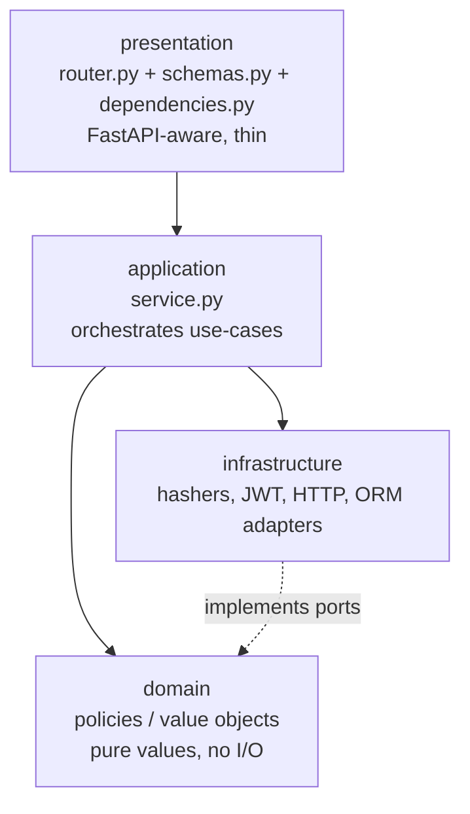

**Rule of dependencies:** outer layers depend inward only. `domain` never
imports framework or database code. The router never decodes tokens or
hashes passwords directly — it asks the service.

The `auth/` module is fully refactored to this shape:

```
auth/
  router.py             presentation — FastAPI handlers
  schemas.py            Pydantic DTOs (TokenOut, RegisterIn, ...)
  dependencies.py       get_current_operator, require_role
  jwt_auth.py           compat re-exports for legacy import paths
  domain/policies.py    VALID_ROLES, LOCK_ATTEMPTS, LOCK_MINUTES, ...
  application/
    auth_service.py     register / login / logout + lockout policy
    mfa_service.py      setup / enable / disable / verify
  infrastructure/
    password_hasher.py  bcrypt wrapper
    token_service.py    JWT encode/decode (owns rebound _cfg)
    totp_provider.py    pyotp wrapper
```

Other backend modules (`tracking`, `alerts`, `reports`, `messaging`, ...)
follow the same target shape; today they are typically a single
`router.py` plus implicit ORM use, and will be split module-by-module
without breaking the public import surface.

---

## 4. The real-time bus

A single in-process broadcaster fans out events from every domain router
to every connected WebSocket client. The interface is small on purpose:
swapping for Redis Pub/Sub or NATS later means replacing one class.

```mermaid
flowchart LR
  subgraph emitters["Event emitters"]
    T[tracking/router<br/>position updates]
    A[alerts/router<br/>TIC, MEDICAL, EVAC, LOST_COMMS]
    R[reports/router<br/>CASEVAC, MEDEVAC, CAS, ...]
    M[messaging/router<br/>chat]
    C[cot/router<br/>CoT XML in]
    TO[tactical_objects<br/>graphics edits]
  end

  BUS[[websocket/manager<br/>ConnectionManager<br/>broadcaster.broadcast]]
  WS[/ws?token=...]
  CLIENTS["Connected clients<br/>web browsers · Android · ATAK"]

  T  -- channel=tracking         --> BUS
  A  -- channel=alert            --> BUS
  R  -- channel=report           --> BUS
  M  -- channel=chat             --> BUS
  TO -- channel=tactical-object  --> BUS
  C  -- channel=tracking         --> BUS

  BUS --> WS --> CLIENTS
  BUS -- channel=presence --> WS
```

**Channels in use:** `presence`, `tracking`, `tactical-object`, `alert`,
`chat`, `report`. New channels are added via
`broadcaster.broadcast({"channel": "...", "event": "...", "data": ...})`.

**Auth on the socket:** the WebSocket endpoint requires a valid JWT
(same secret as the REST API). MFA-pending tokens are rejected.

---

## 5. Data model (key entities)

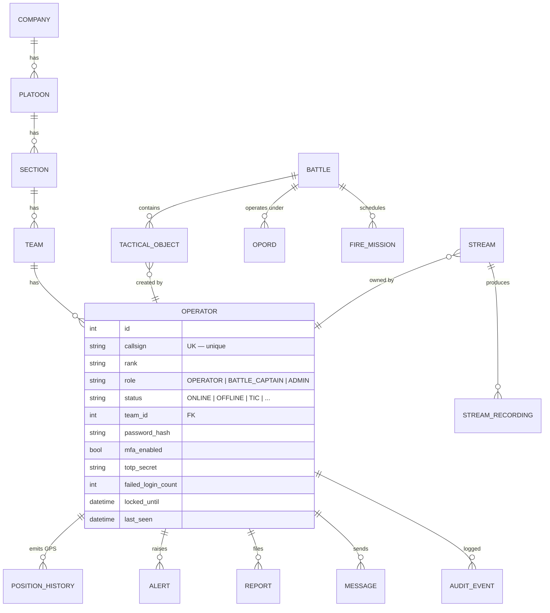

`Operator.role` is enforced by `require_role(...)`. `last_seen` drives the
90-second online/offline computation in `GET /hierarchy`.

---

## 6. Login + MFA flow

The full second-factor path, including lockout and audit hooks.

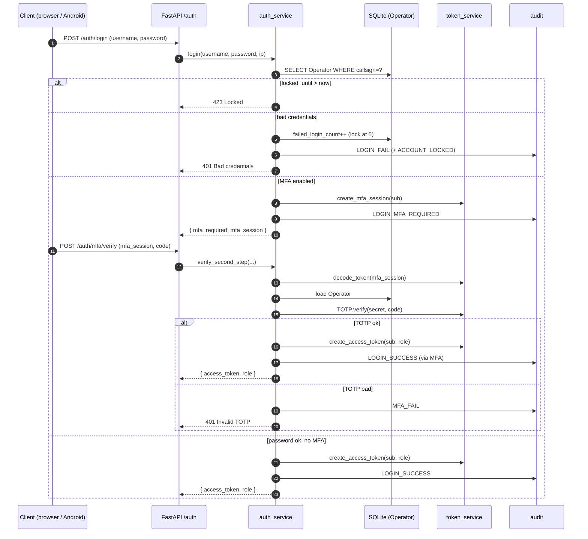

The router stays a thin pass-through; the service owns lockout policy and
audit. The infrastructure layer owns bcrypt, JWT, and pyotp — the service
never touches those libraries directly.

---

## 7. Real-time tracking flow

How a GPS ping from an Android device reaches every connected dashboard.

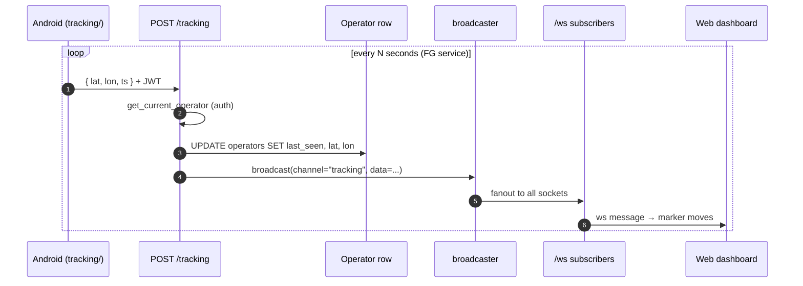

The same path is used by the CoT bridge (`/cot` POST → `cot/router` decodes
XML → broadcaster), which makes ATAK clients first-class peers.

---

## 8. Web dashboard layering

After the recent refactor, the Flask side has the same four-layer shape
as the backend modules. Every blueprint is a thin shell that calls
`PageService` → returns a `PageView` → `FlaskTemplateRenderer` renders it.

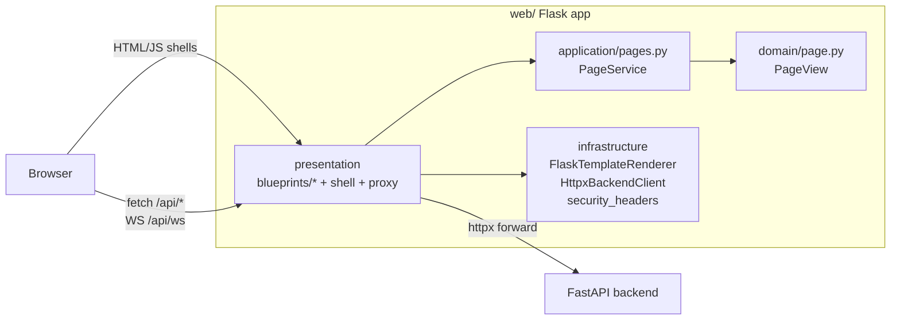

`create_app(...)` is the composition root and accepts overrides for
`config`, `service`, `renderer`, and `backend_client`, so tests can swap
in fakes without spinning up the FastAPI server.

---

## 9. Deployment topology

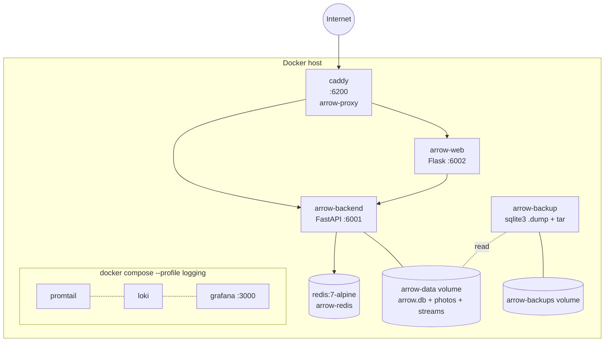

Lifecycle is managed by `deploy.sh`:

| Command | Effect |
|---|---|
| `./deploy.sh up` | build + start (removes leftover containers first) |
| `./deploy.sh rebuild` | `--no-cache` build + force-recreate |
| `./deploy.sh down` | stop & remove |
| `./deploy.sh logs` | tail compose logs |
| `./deploy.sh status` | `docker compose ps` |

---

## 10. Security architecture

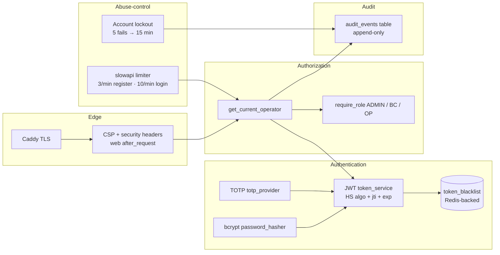

**Key invariants:**

- Every protected route depends on `get_current_operator` (or `require_role`).
  Routers never decode tokens themselves.
- MFA-session tokens (`mfa_pending=true`) cannot authenticate API calls —
  only `POST /auth/mfa/verify`.
- `/auth/logout` writes the JWT's `jti` to the blacklist; expired entries
  age out naturally.
- The JWT secret is auto-generated on first boot if config still holds the
  default, persisted under `data/jwt_secret.key` in the `arrow-data`
  volume. The lifespan rebinds `token_service._cfg` after resolution.

---

## 11. Test architecture

Tests are split by kind, not by feature:

```
tests/
  conftest.py            # shared fixtures — in-memory SQLite, seeded admin,
                         # rate-limiter disabled
  unit/                  # pure, no network
    test_cot.py          # CoT encoder/decoder
    test_pages.py        # web PageService
    test_proxy.py        # web proxy with fake BackendClient
  integration/           # FastAPI TestClient + real SQLite (in-memory)
    test_auth_and_tracking.py
    test_messaging.py
    test_tactical_graphics.py
    test_streams.py
    test_photos_list.py
    test_map_snapshots.py
  e2e/
    test_full_flow.py    # full multi-role scenario
```

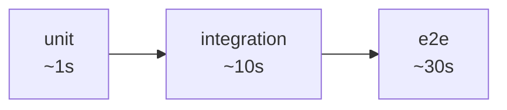

`pytest tests/unit -q` is fast enough to run on every save; the full suite
runs in ~46s.

---

## 12. Configuration & startup

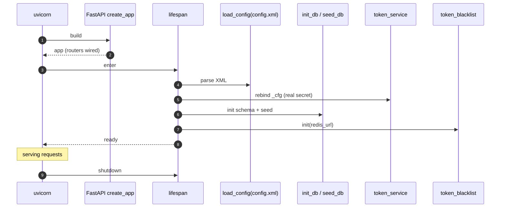

`config.xml` is read at **import time** in `storage/database.py` and
`auth/infrastructure/token_service.py`. The lifespan then patches the
JWT cfg with the resolved secret. Restart the process to pick up
`config.xml` edits during development.

---

## 13. Where to start reading

| If you want to understand... | Start at |
|---|---|
| How a request is authenticated | `backend/auth/dependencies.py` → `auth_service` |
| The realtime bus | `backend/websocket/manager.py` |
| How GPS reaches the web map | `backend/tracking/router.py` then `web/templates/map.html` |
| ATAK / CoT interop | `backend/cot/cot.py` and `backend/cot/router.py` |
| How to add a new domain module | Copy `auth/`'s layered shape: domain → infra → application → router |
| How the dashboard wires layers | `web/app.py` (composition root) |
| How the stack runs in prod | `docker-compose.yml`, `Caddyfile`, `deploy.sh` |

---

*Last updated: refactor pass that introduced layered architecture in
`web/` and `backend/auth/`, plus the unit/integration/e2e test split.*
